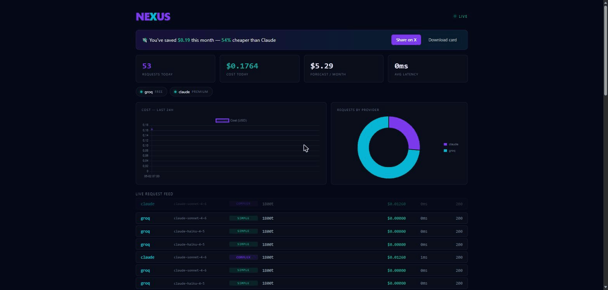

# NEXUS

**Smart proxy + live dashboard for Claude Code — and every AI coding tool.**  
Route Claude Code, Cursor, aider, and any OpenAI/Anthropic app to the cheapest capable LLM — automatically.

<!-- Hero: record the live dashboard at http://localhost:2222 and save it as docs/dashboard.gif, then uncomment: -->
<!--  -->

```bash
curl -fsSL https://get.nexus.sh | sh
nexus start
```

> **NEXUS is running**  
> Proxy: http://localhost:3000  
> Dashboard: http://localhost:2222

```bash
export ANTHROPIC_BASE_URL=http://localhost:3000
export ANTHROPIC_API_KEY=nexus-local
claude  # Claude Code now uses NEXUS
```

---

## Why NEXUS?

Claude Code is the best agentic coding CLI. But Anthropic's API costs add up fast.

NEXUS sits between Claude Code and the providers — intelligently routing requests to the cheapest model that can handle the task.

| Task | Without NEXUS | With NEXUS |
|------|--------------|------------|
| Quick question | Claude Haiku $0.0012 | Groq Llama **$0.00** |
| Code refactor | Claude Sonnet $0.08 | DeepSeek **$0.002** |
| Architecture | Claude Opus $0.45 | Claude Opus $0.45 |
| **Monthly total** | **~$120** | **~$8** |

---

## What makes NEXUS different

**Single binary** — one `curl | sh`, no Python, no Docker, no config files required.

**Intelligent router** — classifies task complexity before routing. Simple questions go free. Complex architecture stays on Claude.

**Live dashboard** — beautiful real-time UI showing every request, cost, and provider. The first proxy that's actually pleasant to use.

**Zero Claude Code changes** — one env var. That's it.

**Universal gateway** — speaks both the Anthropic API (`/v1/messages`) and the OpenAI API (`/v1/chat/completions`), so Claude Code, Cursor, aider, Continue, Cline, Zed, and any OpenAI SDK app all route through one proxy.

**Smart cache** — identical requests are served instantly and for free.

**Shareable savings** — a live "you saved $X vs. Claude" card you can post anywhere.

---

## Use it with any tool

NEXUS exposes **both** the Anthropic and OpenAI APIs, so point any client at it:

```bash
# Claude Code (Anthropic API)
export ANTHROPIC_BASE_URL=http://localhost:3000
export ANTHROPIC_API_KEY=nexus-local

# Cursor / aider / Continue / Cline / any OpenAI SDK app (OpenAI API)
export OPENAI_BASE_URL=http://localhost:3000/v1
export OPENAI_API_KEY=nexus-local
```

Every request is classified and routed to the cheapest capable provider, cached
when identical, and shown live on the dashboard with its cost. The dashboard's
**Share** button posts your savings card to X in one click.

---

## Install

### macOS / Linux
```bash
curl -fsSL https://raw.githubusercontent.com/lynuxis2026-pixel/nexus-proxy/main/install.sh | sh
```

### Windows (PowerShell)
```powershell
irm https://raw.githubusercontent.com/lynuxis2026-pixel/nexus-proxy/main/install.ps1 | iex
```

### Homebrew
```bash
brew install nexus-proxy/tap/nexus
```

### Build from source
Requires Go 1.22+ (and Node 20+ only if you want to rebuild the dashboard).
```bash
git clone https://github.com/lynuxis2026-pixel/nexus-proxy.git
cd nexus
make build          # builds dashboard + embeds + compiles → bin/nexus
# or, without Node (uses the committed dashboard build):
go build -o bin/nexus ./cmd/nexus
```

### Manual
Download a prebuilt binary from [releases](https://github.com/lynuxis2026-pixel/nexus-proxy/releases).

---

## Add providers

```bash
# Add providers (free first, Claude as fallback)
nexus add groq    YOUR_GROQ_KEY    # free tier — groq.com
nexus add gemini  YOUR_GEMINI_KEY  # free tier — aistudio.google.com
nexus add deepseek YOUR_DEEPSEEK_KEY  # $0.27/1M — deepseek.com

# Or run fully offline
nexus add ollama  # requires Ollama running locally

# Keep Claude for complex tasks
nexus add anthropic YOUR_ANTHROPIC_KEY
```

---

## Routing strategies

NEXUS has 4 routing modes:

```bash
nexus start --strategy auto      # intelligent (default)
nexus start --strategy cheapest  # always cheapest available
nexus start --strategy fastest   # lowest latency
nexus start --strategy manual    # explicit model mapping
nexus start --budget 5           # cap spend at $5/day → free/local only when exceeded
```

**Auto mode** classifies each request:

| Complexity | Routes to | Cost |
|-----------|-----------|------|
| Simple (<200 tokens, no tools) | Groq Llama 3.3 | **Free** |
| Standard (code, refactor, explain) | DeepSeek V3 | **$0.001** |
| Complex (architecture, planning) | Claude Sonnet | $0.05 |
| Critical (security, urgent) | Claude Opus | $0.40 |

---

## Dashboard

Open `http://localhost:2222` after starting NEXUS.

- **Live request feed** — every request in real-time
- **Cost meter** — today / this week / forecast
- **Provider health** — latency and status per provider  
- **Model breakdown** — see which models handle what

---

## CLI reference

```bash
nexus start              # start proxy + dashboard
nexus add <provider> <key>  # add a provider
nexus status             # provider health check
nexus models             # show Claude→provider model mapping
nexus logs               # recent requests
nexus cost               # cost breakdown
nexus config             # show config path
nexus version            # show version
```

---

## Supported providers

NEXUS speaks the Anthropic API to Claude Code and translates to each provider's
API under the hood. **24 providers built in** — plus any OpenAI-compatible
endpoint via a custom provider (see below).

| Provider | Add it | Tier |
|----------|--------|------|
| Anthropic | `nexus add anthropic <key>` | Premium |
| OpenAI | `nexus add openai <key>` | Premium |
| xAI (Grok) | `nexus add xai <key>` | Premium |
| DeepSeek | `nexus add deepseek <key>` | Standard |
| Mistral | `nexus add mistral <key>` | Standard |
| Cohere | `nexus add cohere <key>` | Standard |
| Together AI | `nexus add together <key>` | Standard |
| Fireworks | `nexus add fireworks <key>` | Standard |
| OpenRouter | `nexus add openrouter <key>` | Standard |
| DeepInfra | `nexus add deepinfra <key>` | Standard |
| Perplexity | `nexus add perplexity <key>` | Standard |
| Novita | `nexus add novita <key>` | Standard |
| Hyperbolic | `nexus add hyperbolic <key>` | Standard |
| Nebius | `nexus add nebius <key>` | Standard |
| Moonshot (Kimi) | `nexus add moonshot <key>` | Standard |
| Zhipu (GLM) | `nexus add zhipu <key>` | Standard |
| AI21 (Jamba) | `nexus add ai21 <key>` | Standard |
| Lambda | `nexus add lambda <key>` | Standard |
| Groq | `nexus add groq <key>` | Free |
| Gemini | `nexus add gemini <key>` | Free |
| Cerebras | `nexus add cerebras <key>` | Free |
| SambaNova | `nexus add sambanova <key>` | Free |
| NVIDIA NIM | `nexus add nvidia <key>` | Free |
| Ollama | `nexus add ollama` | Local |

`nexus models` shows exactly which model each Claude tier maps to per provider.

### Any OpenAI-compatible endpoint (custom providers)

Point NEXUS at vLLM, LM Studio, LiteLLM, an Azure-style deployment, or any new
API — no code required:

```bash
nexus add myllm sk-xxx --type openai-compatible --base-url https://my-host/v1
```

### Use environment variables for keys

Keep secrets out of the config file:

```toml
[[providers]]
name = "groq"
api_key = "env:GROQ_API_KEY"   # read from $GROQ_API_KEY at runtime
```

### Override model mapping (no rebuild)

Pin which provider model each Claude tier maps to:

```toml
[[providers]]
name = "groq"
[providers.model_map]
"claude-sonnet-4-6" = "llama-3.3-70b-versatile"
"claude-haiku-4-5"  = "llama-3.1-8b-instant"
"default"           = "llama-3.3-70b-versatile"
```

### Automatic failover

If a provider returns `429` or a `5xx`, NEXUS transparently fails over to the
next provider in the routing chain — so a rate-limited free tier never breaks
your session. A background health check probes every provider on an interval and
skips ones that are down (they recover automatically).

### Daily budget cap

```bash
nexus start --budget 5        # or set routing.daily_budget_usd in config.toml
```

Once today's spend hits the cap, NEXUS routes only to **free/local** providers
for the rest of the day — premium models resume tomorrow.

### Enterprise providers (Azure, Bedrock, Vertex)

```bash
# Azure OpenAI (api-key auth, deployment endpoint)
nexus add azure "$AZURE_KEY" --type azure \
  --base-url https://my-res.openai.azure.com/openai/deployments/gpt-4o --api-version 2024-10-21

# AWS Bedrock (SigV4 — reads AWS_ACCESS_KEY_ID / AWS_SECRET_ACCESS_KEY from env)
nexus add bedrock --type bedrock --region us-east-1

# Google Vertex AI (bearer access token)
nexus add vertex "env:GCP_TOKEN" --type vertex --region us-east5 --project my-project
```

Bedrock and Vertex speak Claude's native Messages API; Azure uses the OpenAI
format. Streaming works for all providers — OpenAI-compatible ones are converted
token-by-token, Bedrock/Vertex are buffered then re-streamed.

All three accept an optional `--base-url` to route through a gateway, VPC
endpoint, or local proxy. That's also how NEXUS integration-tests them offline —
the full URL / auth (SigV4, bearer, api-key) / body-transform / response path is
verified in CI against an in-process server, with no cloud account required.

---

## How it works

```
Claude Code → NEXUS Proxy → Classifier → Router → Provider
                               ↓
                          SQLite log
                               ↓
                        Dashboard (SSE)
```

NEXUS intercepts every Claude Code request at `POST /v1/messages`. The classifier analyzes the prompt complexity, the router picks the best available provider, and the response is transformed back to Anthropic format — invisible to Claude Code.

---

## Configuration

Config is stored at `~/.nexus/config.toml`. NEXUS works with zero config — just add providers.

```toml
[proxy]
port = 3000

[dashboard]
port = 2222

[routing]
strategy = "auto"

[[providers]]
name = "groq"
api_key = "gsk-..."
tier = "free"
```

---

## Contributing

PRs welcome. See [CONTRIBUTING.md](CONTRIBUTING.md).

Areas that need help:
- More provider integrations
- Dashboard components (Svelte)
- Better complexity classification
- Windows testing

---

## License

MIT — do whatever you want.

---

*Built by someone tired of watching Claude API credits disappear.*
